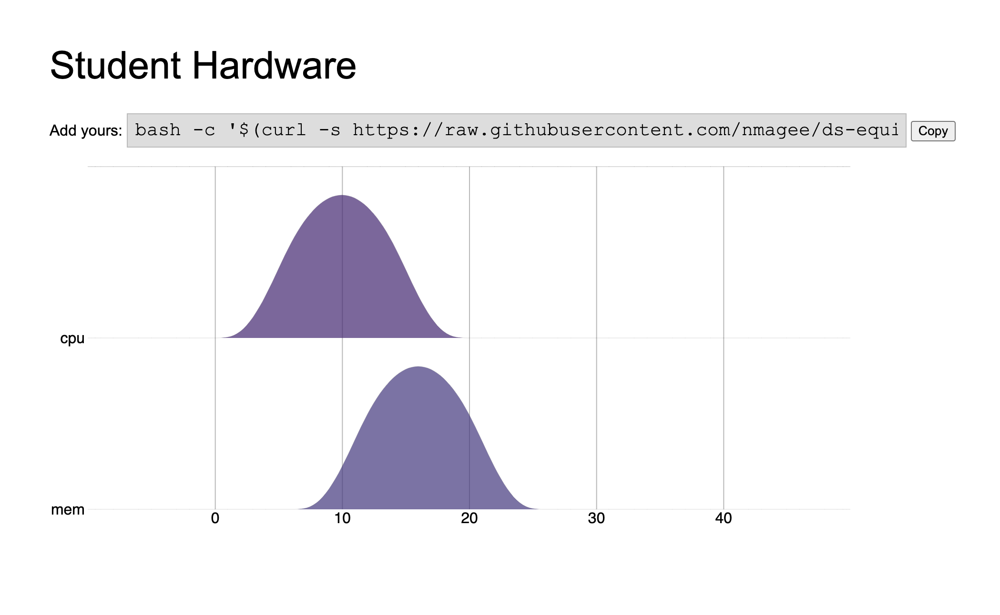

# ds-equipment

A simple web interface and API for tracking and displaying student hardware.

[**Web Interface**](https://d2j6tmlma43t81.cloudfront.net/)

To submit your computer's specifications, run this command:

    bash -c '$(curl -s https://raw.githubusercontent.com/nmagee/ds-equipment/main/frontend/add-mine.sh )'

